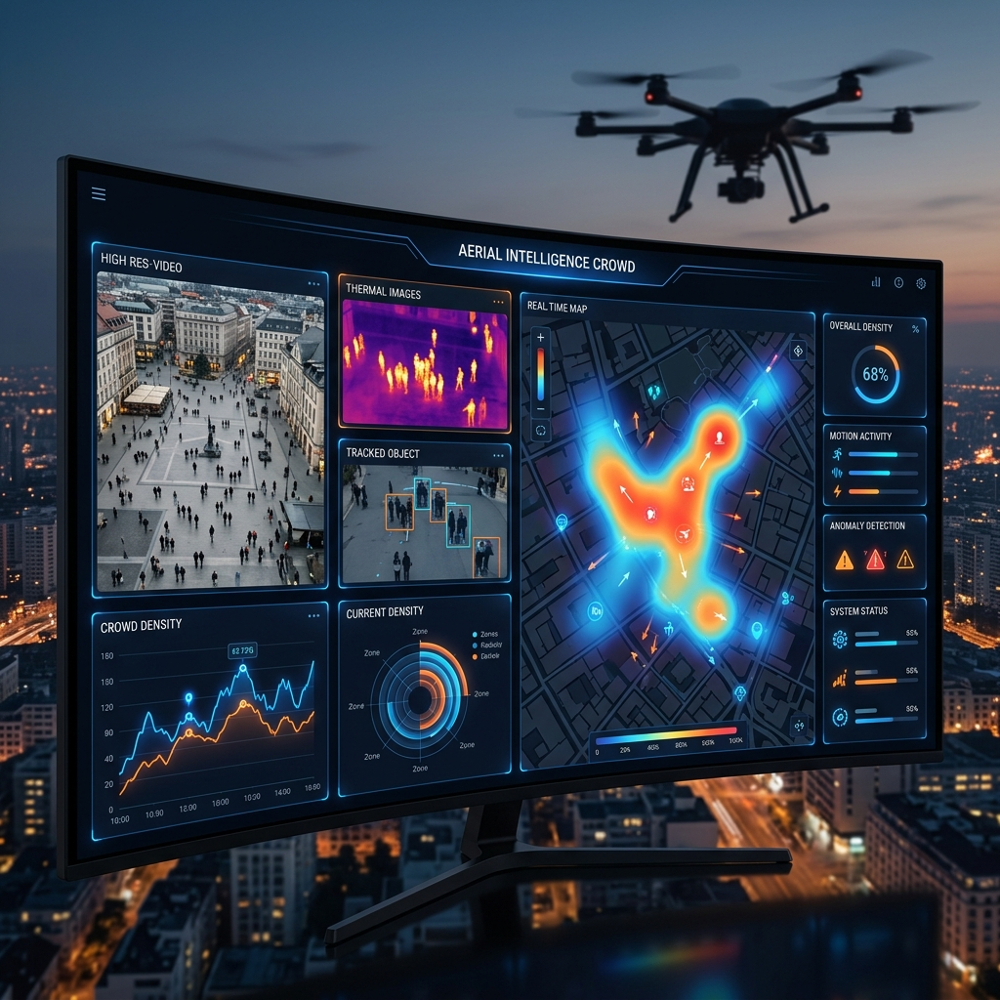

# 🛰️ Aerial Intelligence for Illegal Activity Detection (CIAA)



[](https://www.python.org/)
[](https://flask.palletsprojects.com/)
[](https://streamlit.io/)
[](https://ultralytics.com/)
[](https://www.tensorflow.org/)

**CIAA** (Crowd Intelligence & Aerial Analytics) is a professional-grade surveillance and monitoring platform designed for real-time crowd detection, density forecasting, and activity analysis. Leveraging state-of-the-art computer vision (YOLOv8) and deep learning (LSTM), it provides actionable insights for urban planning, safety management, and illegal activity prevention.

---

## 🌟 Key Features

### 🚀 Real-Time Detection & Tracking
*   **Precision Monitoring**: High-accuracy person detection using YOLOv8 optimized for aerial and wide-angle views.
*   **Multi-Source Support**: Seamless integration with Webcams, RTSP streams, and local video files.
*   **Dynamic Heatmaps**: Real-time visual density maps to identify bottlenecks and high-traffic areas instantly.

### 📈 Predictive Analytics (Forecasting Engine)
*   **LSTM-Powered Predictions**: Advanced Deep Learning models to forecast crowd density for the next 60 minutes.
*   **Hybrid Statistical Models**: Combines Linear Regression and Exponential Smoothing for robust short-term and long-term trends.
*   **Alert System**: Proactive notifications for predicted overcrowding events before they happen.

### 💬 NLP-Driven Dashboard
*   **Voice/Text Commands**: Control your surveillance grid using natural language (e.g., *"Switch to heatmap mode"*, *"Start monitoring the RTSP feed"*).
*   **Multi-Provider AI**: Integrated support for **OpenAI (GPT-4o)**, **Google Gemini**, and **Ollama** (Local Llama 3).

### 🗺️ Geospatial Intelligence
*   **Live Mapping**: Interactive Folium maps with real-time location markers.
*   **Zone Monitoring**: Define custom inclusion/exclusion zones (geofencing) to monitor specific critical areas.
*   **IP-Based Location**: Automatic detection of camera deployment locations.

---

## 🛠️ Tech Stack

-   **Core**: Python 3.13+
-   **Computer Vision**: Ultralytics YOLOv8, OpenCV
-   **Deep Learning**: TensorFlow/Keras (LSTM), Scikit-learn
-   **Web Frameworks**: Flask (Main Dashboard), Streamlit (Analytics Pro)
-   **NLP Integration**: OpenAI, Gemini, Ollama
-   **Visualization**: Folium (Maps), Chart.js (Web), Pandas (Data)

---

## 🚀 Getting Started

### 1️⃣ Installation
```bash
# Clone the repository
git clone https://github.com/buildvithsagar/Aerial-intelligence-for-illegal-activity-detection.git
cd Aerial-intelligence-for-illegal-activity-detection

# Install dependencies
pip install -r requirements.txt
```

### 2️⃣ Configuration
Create a `.env` file in the root directory:
```env
OPENAI_API_KEY=your_key_here
GEMINI_API_KEY=your_key_here
OLLAMA_BASE_URL=http://localhost:11434
```

### 3️⃣ Running the Application

**Option A: Professional Web Dashboard (Flask)**
```bash
python web_app.py
```
*Access at: `http://localhost:5000`*

**Option B: Interactive Analytics Pro (Streamlit)**
```bash
streamlit run streamlit_app.py
```
*Access at: `http://localhost:8501`*

---

## 📊 Dashboard Preview

| Feature | Description |
| :--- | :--- |
| **Detection Mode** | High-precision bounding boxes for individual tracking. |
| **Heatmap Mode** | Visual representation of "hot zones" in the area. |
| **Forecasting** | Charting predicted crowd growth vs. current capacity. |
| **Zone Alerts** | Real-time counting specifically within user-drawn rectangles. |

---

## 🛡️ Safety & Privacy
This tool is designed for safety and surveillance compliance. Ensure you have the necessary permissions for monitoring public or private spaces in your jurisdiction.

## 📄 License
Distributed under the MIT License. See `LICENSE` for more information.

---
**Developed by [Sagar Agnihotri](https://github.com/buildvithsagar)**